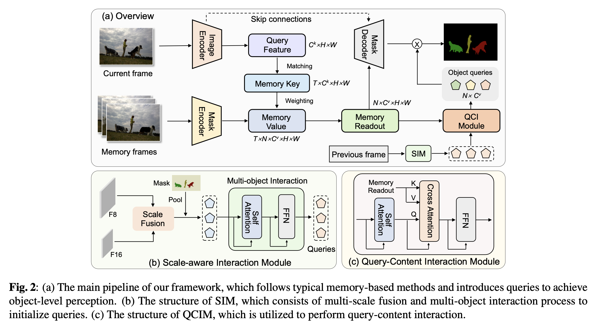
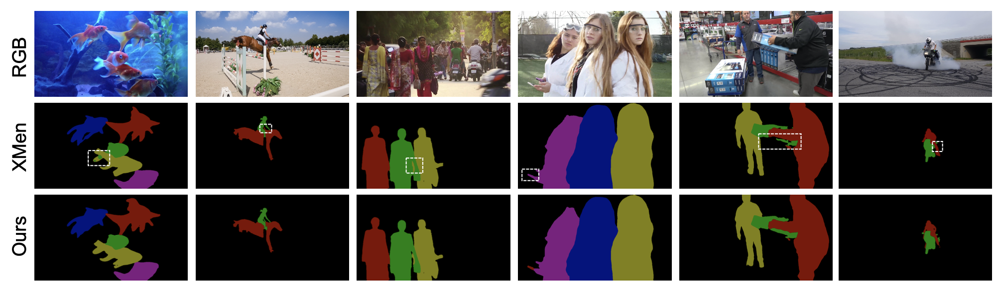

# Video Object Segmentation with Dynamic Query Modulation

## :loudspeaker: Introduction
This is the official implementation of our paper titled "Video Object Segmentation with Dynamic Query Modulation", abbreviated as QMVOS. This paper has been accepted by 2024 IEEE International Conference on Multimedia and Expo (ICME).

For more details, please refer to our [paper](https://arxiv.org/abs/2403.11529). This repo is based on PyTorch.



The code of our SIM and QCIM please refer to model/QMVOS_trainer.py.

## :open_file_folder: Result and Weight
Our QMVOS can bring significant improvements to memory-based SVOS method and achieve competitive performance on standard SVOS bench- marks.

We release the weight of models used in our paper.  **You may need to log out of your Google account to download them.**

Download the weight(s) from corresponding links below.
 - Google Drive (https://drive.google.com/file/d/1XVXo2W7seI6Jor6Jsv-f6Qk8PCgeOm_r/view?usp=drive_link); 
 - BaiduNetDisk (链接: https://pan.baidu.com/s/1bvk6QM4FL2g-lzghM-cMxQ?pwd=ke2n 提取码: ke2n)


## 🚀 Training
More detail please see [mmdetection](https://github.com/open-mmlab/mmdetection).
```
bash train.sh
python -m torch.distributed.launch --master_port 25764 --nproc_per_node=4 --use_env train_QMVOS.py --exp_id train_QMVOS --stage 3
```

## :ferris_wheel: Visualization

Examples of segmentation results obtained by our QMVOS and baseline (Xmem).


## 📚  Citation
Please cite our work if you find our work and codes helpful for your research.
```
@article{zhou2024video,
  title={Video Object Segmentation with Dynamic Query Modulation},
  author={Zhou, Hantao and Hu, Runze and Li, Xiu},
  journal={arXiv preprint arXiv:2403.11529},
  year={2024}
}
```

## Acknowledgement

This project is built upon numerous previous projects. We'd like to thank the contributors of [Xmem](https://github.com/hkchengrex/XMem).
